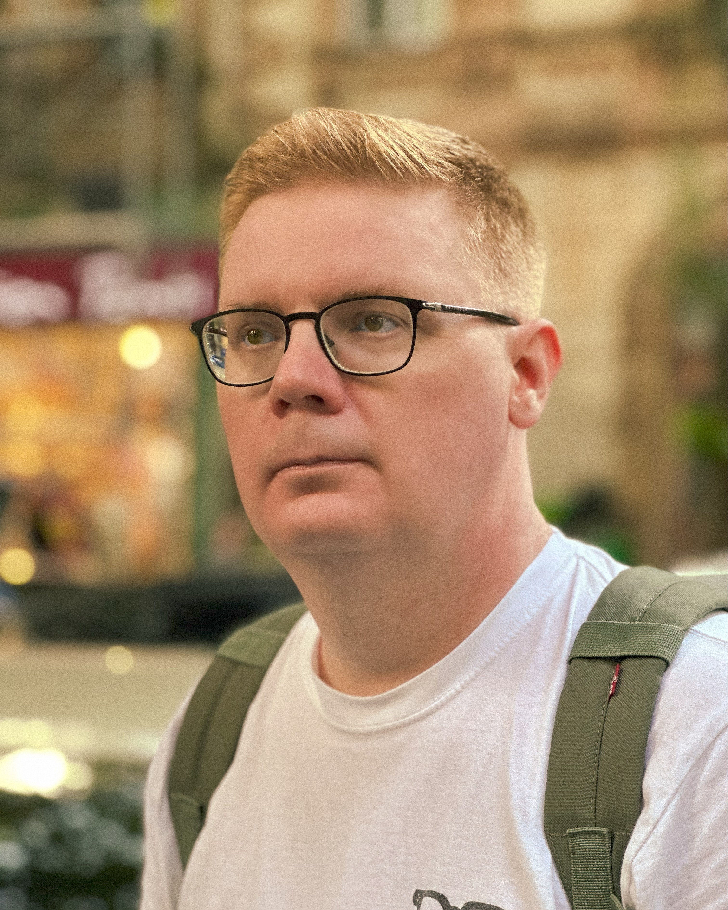

# About Me

I am an Enterprise Architect, Business Analyst, and Strategic Consultant based in Batumi, Georgia.

## Certifications

- TOGAF® 10 Certified
- AWS Certified Solutions Architect
- Google Cloud Digital Leader

## Areas of Expertise

- Strategic Planning and Execution
- Enterprise Architecture (TOGAF, ArchiMate)
- IT Strategy Alignment
- Business Capability Mapping
- Product Portfolio Management
- Business Process Optimization
- System and Requirements Analysis

## Teaching and Mentoring

I have taught courses on Enterprise Architecture and Project Management at MIIT (Moscow State University of Railway Engineering), trained over 60 product managers at Domodedovo Airport, and mentored professionals transitioning into IT roles.

## Contact

- 📧 vkgeorgia@icloud.com  
- 📞 +995 598 807 092  
- [LinkedIn](https://www.linkedin.com/in/valeriikorobeinikov)
